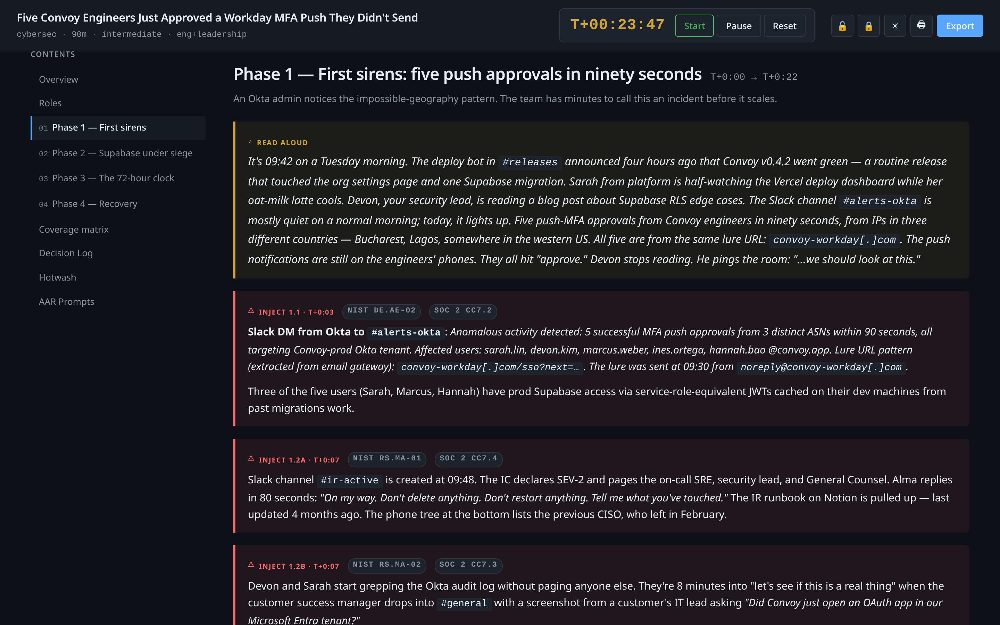

# claude-tabletop

> Drop Claude Code into any project folder and generate a tailored tabletop exercise — with an interactive HTML runbook, fillable forms, and a paired After-Action Report drafter.

**▶︎ [Live demo](https://live-demo-zeta-one.vercel.app)** — interactive runbook generated by `/tabletop-exercise` for a fictional SaaS account-takeover scenario. Start the timer, reveal injects, log decisions, export state.

Two paired Claude Code skills that turn the `/tabletop-exercise` slash command into a complete tabletop exercise (TTX) generator. The skills survey your project, propose scenarios that actually match the stack you're running, and produce a polished facilitator runbook plus an interactive single-file HTML version with a live exercise timer, per-inject reveal overlays, and a JSON export that the companion `/tabletop-aar` skill consumes to draft the After-Action Report.

<p align="center">
  <video src="docs/demos/runbook-demo.mp4" controls width="960" muted playsinline poster="docs/screenshots/runbook-dark-hero.png">
    
  </video>
</p>

> 22 seconds of an exercise mid-run — sticky timer ticks toward the next inject, two phase-1 injects reveal in sequence, a decision gets logged with auto-timestamp, theme flips light, state exports to JSON. (Click play above, or open the [animated GIF](docs/demos/runbook-demo.gif) directly.)

## Why this exists

Most tabletop exercise generators give you a static script. Most security skills for Claude Code stop at "produce a markdown document." This skill goes further:

- **Project-aware scenario selection.** Reads your README, manifests, IaC, CI/CD configs and picks scenarios that match the actual stack — not generic "your application" filler.
- **Interactive HTML runbook.** Single self-contained file with a live exercise timer, per-inject reveal overlays so participants can't peek ahead, decision log with auto-timestamping, form fields that auto-save, dark/light themes, print stylesheet, and a JSON export.
- **Paired AAR drafter.** Run the exercise, click "Export state" in the HTML, then `/tabletop-aar --from-json <path>` to get a structured After-Action Report with severity-tagged action items.
- **9 domains.** Cybersecurity, product security, DevOps/SRE, privacy/compliance, data/ML, platform, mobile, AI safety, and business continuity — not just cyber.
- **Compliance framework tagging.** Optional `--frameworks NIST-CSF,SOC2,PCI,ISO27001,HIPAA,GDPR,MITRE-ATTACK` tags every inject with control IDs and emits a coverage matrix at the end of the runbook.



> Every inject carries control IDs against the frameworks you opted into, with stack-specific detail (Okta, Supabase, Vercel, Slack) drawn from the project recon — not generic placeholder text.

## Install

```bash
git clone https://github.com/cjcsecurity/claude-tabletop.git
cp -r claude-tabletop/skills/tabletop-exercise ~/.claude/skills/
cp -r claude-tabletop/skills/tabletop-aar ~/.claude/skills/
```

That's it. Open Claude Code in any project folder; `/tabletop-exercise` and `/tabletop-aar` are now available.

If you'd rather symlink so updates flow through:

```bash
ln -s "$(pwd)/claude-tabletop/skills/tabletop-exercise" ~/.claude/skills/tabletop-exercise
ln -s "$(pwd)/claude-tabletop/skills/tabletop-aar"      ~/.claude/skills/tabletop-aar
```

See `docs/INSTALL.md` for full options including project-local install.

## Quickstart

```
cd /path/to/some-project
/tabletop-exercise
```

Claude scans the project, asks four quick setup questions (duration, who's playing, difficulty, headcount), proposes 3 scenarios that match the stack, and after you pick one it produces:

```
tabletop-exercises/2026-05-07-<scenario-slug>/
├── RUNBOOK.md              # facilitator guide (full spoilers)
├── RUNBOOK.html            # interactive runbook — open in a browser to facilitate
├── PARTICIPANT-PACKET.md   # send to attendees ahead of time
├── INJECTS.md              # standalone inject deck for fast facilitator reference
├── facilitator-notes.md    # pre-exercise prep checklist
└── forms/
    ├── attendance.md
    ├── decision-log.md
    ├── timeline-reconstruction.md
    ├── gaps-and-findings.md
    └── aar-template.md
```

Run the exercise. Open `RUNBOOK.html` in a browser, hit Start on the timer, click Reveal on each inject as you drop it. Capture decisions in the live decision-log table. When the room finishes, click **Export state** — you'll get a JSON file with everything captured.

Then:

```
/tabletop-aar --from-json tabletop-exercises/<slug>/runbook-state.json
```

Drafts `AAR.md` and `AAR.html` with executive summary, timeline reconstruction, what-went-well/didn't, gaps by category, and severity-tagged action items.

> **First-run tip**: kick the tires with a smoke test before committing to a full run.
> ```
> /tabletop-exercise --duration 30m --no-html
> ```
> Produces just the markdown in 2-4 minutes so you can verify the skill works on your project before generating the full HTML package. Passing flags also skips the matching interactive question, so the smoke test runs without prompts.

## Power-user flags

`/tabletop-exercise` is interactive by default — Claude asks duration, audience, difficulty, and headcount in one prompt round, then runs scenario triage. Every input also accepts a flag, and **passing a flag skips its matching prompt**, so you can run flagless (recommended for first-timers) or fully-flagged (recommended for scripts and repeats).

### `/tabletop-exercise`

| Flag | Values | Default | Effect |
|------|--------|---------|--------|
| `--scenario <slug>` | any slug from the scenario library | (interactive triage) | Skip the triage step |
| `--domain <name>` | `cybersec`, `prodsec`, `devops`, `privacy`, `data-ml`, `platform`, `mobile`, `ai-safety` | (inferred) | Narrow the scenario library |
| `--duration <len>` | `30m`, `60m`, `90m`, `half-day`, `full-day` | `90m` | Phase count, inject density |
| `--audience <who>` | `eng`, `eng+leadership`, `cross-functional`, `board` | `eng+leadership` | Register, role-table composition, decision focus |
| `--difficulty <lvl>` | `basic`, `intermediate`, `advanced` | `intermediate` | Inject complexity, branching depth |
| `--headcount <range>` | `2-4`, `5-8`, `9-15`, `16+` | `5-8` | Role-table size, attendance-form rows, breakout recommendation |
| `--frameworks <list>` | comma-sep: `NIST-CSF`, `SOC2`, `PCI`, `ISO27001`, `HIPAA`, `GDPR`, `MITRE-ATTACK` | (off) | Tag injects + emit coverage matrix (flag-only — niche) |
| `--no-html` | flag | (html on) | Markdown only (flag-only) |
| `--campaign <name>` | string | none | Multi-session linked exercises (flag-only — advanced) |

### `/tabletop-aar`

| Flag | Values | Default | Effect |
|------|--------|---------|--------|
| `--exercise <path>` | path to exercise dir | (most recent) | Which exercise to AAR |
| `--from-json <path>` | path to runbook JSON export | none | Use HTML state JSON instead of markdown forms |
| `--audience <who>` | `internal`, `leadership`, `regulator`, `board` | `leadership` | Register; redacts names for `regulator`/`board` |
| `--no-html` | flag | (html on) | Markdown only |

## What's in the box

| Asset | Size |
|-------|------|
| Scenario library | 54 scenarios across 9 domains |
| Inject patterns | 38 reusable archetypes (opener, escalation, decision-forcing, wild-card, etc.) |
| Persona bank | 28 NPCs (panicked CEO, journalist, regulator, ransomware operator, …) |
| Framework controls | 7 frameworks: NIST CSF 2.0, SOC 2, PCI DSS v4, ISO 27001:2022, HIPAA, GDPR, MITRE ATT&CK |
| Runbook templates | Master Markdown structure + 1300-line interactive HTML template |
| AAR template | Master AAR structure with severity rubric and audience-tuned register |

## Domains covered

- **Cybersecurity / IR** — ransomware, breach, account takeover, supply chain, insider threat, DDoS, phishing, leaked AWS keys
- **Product security** — zero-day in dependency, customer-reported vuln, secret in public commit, auth bypass, SSRF
- **DevOps / SRE** — regional outage, bad deploy, DB corruption, cert expiry, IAM lockout, runaway cost
- **Privacy / compliance** — GDPR DSR mid-incident, data residency violation, regulator inquiry, audit prep, legal hold
- **Data / ML** — model exfiltration, training data poisoning, model drift, prompt injection in customer LLM
- **Platform** — internal IdP outage, shared CI/CD compromised, package registry compromise
- **Mobile** — backend API change crashes app, push notification compromise, cert pinning bypass
- **AI safety** — agent destructive action, safety classifier bypassed, prompt injection via document upload
- **Business continuity** — key contributor leaves abruptly, vendor goes bankrupt mid-contract

## Roadmap

These are intentionally not in v0.1 — happy to take PRs:

- [ ] **Regulatory deadline quick-reference card** as a participant handout when `--frameworks` is on (GDPR Art. 33 72hr, SEC 4-day, NERC CIP 1-hour, HIPAA Breach Notification, …)
- [ ] **`--style=bnb`** mode emitting Backdoors & Breaches-shaped procedure/inject cards
- [ ] **MSEL JSON export** for interop with Base4Security/T3SF and other inject-orchestration platforms
- [ ] **`--seed-from-cve <id>`** to pull a recent CISA KEV entry as a scenario seed
- [ ] **Discord/Slack inject bot** companion for remote/distributed exercises
- [ ] More scenarios — every domain has room (especially platform infra and mobile)

## Contributing

PRs welcome. The most useful contributions:

- New scenarios in `skills/tabletop-exercise/references/scenario-library.md`
- New inject archetypes or personas
- Framework controls for compliance regimes not yet covered (FedRAMP, CCPA, CMMC, …)
- Sample exercise outputs to anchor the README

See `CONTRIBUTING.md` for the conventions and review process.

## License

Apache-2.0. See `LICENSE`.

## Credits

Built for Claude Code by [@cjcsecurity](https://github.com/cjcsecurity). Format inspirations include CISA's tabletop exercise package series, NIST SP 800-84, and the Backdoors & Breaches incident-response card game by Black Hills Information Security.
